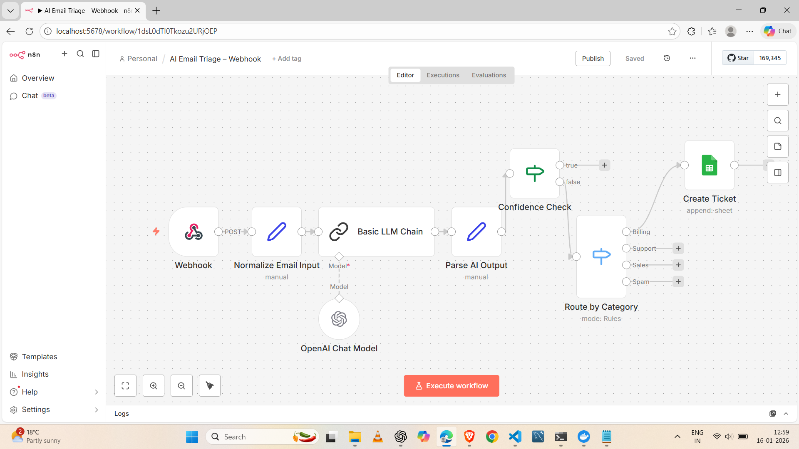

# AI Email Triage Automation (n8n + LLM)

An AI-powered email triage system built using **n8n** and **Large Language Models (LLMs)** to automatically classify incoming emails, assess urgency and confidence, and route them to appropriate downstream actions.

This workflow demonstrates how LLMs can be safely integrated into business automation pipelines with confidence checks and human-in-the-loop design.

---

## 🎯 Business Use Case

Organizations receive a high volume of emails across billing, support, sales, and spam. Manual triage is slow, error-prone, and expensive.

This automation:
- Classifies incoming emails using an LLM
- Determines urgency and confidence
- Routes emails to the correct business workflow
- Stores structured ticket data for tracking and reporting
- Supports human review when AI confidence is low

---

## 🧠 What This Workflow Does

1. Accepts incoming email data via webhook
2. Normalizes raw email fields
3. Uses an LLM to classify the email
4. Parses structured AI output (JSON)
5. Applies a confidence threshold
6. Routes emails based on category
7. Creates a ticket record in Google Sheets

---

## 🏗️ Workflow Architecture

Webhook
↓
Normalize Email Input
↓
LLM Classification (Category, Urgency, Confidence, Summary)
↓
Parse AI Output
↓
Confidence Check
├─ Low Confidence → Human Review (planned)
└─ High Confidence
↓
Route by Category
├─ Billing → Create Ticket (Google Sheets)
├─ Support → (planned)
├─ Sales → (planned)
└─ Spam → (planned)


---

## 🛠️ Tech Stack

- **n8n** – Workflow orchestration
- **OpenAI LLM** – Email classification
- **Google Sheets** – Ticket storage
- **Docker** – Local deployment
- **Webhook-based ingestion**

---

## 🔍 AI Classification Logic

The LLM classifies each email into:

- **category**: `billing | support | sales | spam`
- **urgency**: `low | medium | high`
- **confidence**: numeric score (0–1)
- **summary**: short natural-language summary

The model is constrained to return **strict JSON output** to ensure safe downstream parsing.

---

## 🛡️ Failure Handling & Safety

- **Confidence threshold** prevents unreliable AI decisions
- Low-confidence classifications are designed to route to human review
- Strict JSON parsing avoids malformed LLM outputs
- Modular routing allows easy extension without breaking core logic

---

## 📊 Current Output (Implemented)

For **Billing emails**, the workflow:
- Appends a ticket to Google Sheets with:
  - received_at
  - email_from
  - email_subject
  - summary
  - urgency
  - confidence
  - category
  - status (`new`)

---

## 🔮 Planned Extensions (Designed but Not Yet Activated)

This workflow is intentionally designed with modular routing to support future production-grade extensions:

- **Support Emails**
  - Route to Slack or support inbox
  - Auto-tag with urgency

- **Sales Emails**
  - Push qualified leads into CRM or sales lead sheet
  - Priority scoring based on urgency and confidence

- **Spam Emails**
  - Auto-archive or ignore

- **Low-Confidence Classification**
  - Route to a human review queue
  - Enable human-in-the-loop validation

These can be enabled by attaching actions to existing routing nodes.

---

## 🚀 How to Run Locally

1. Clone the repository
2. Start n8n using Docker:
   ```bash
   docker compose up -d
3. Open n8n at http://localhost:5678

4. Import the workflow JSON

5. Configure credentials (OpenAI, Google Sheets)

6. Trigger the webhook with sample email data

## 📸 Workflow Preview

